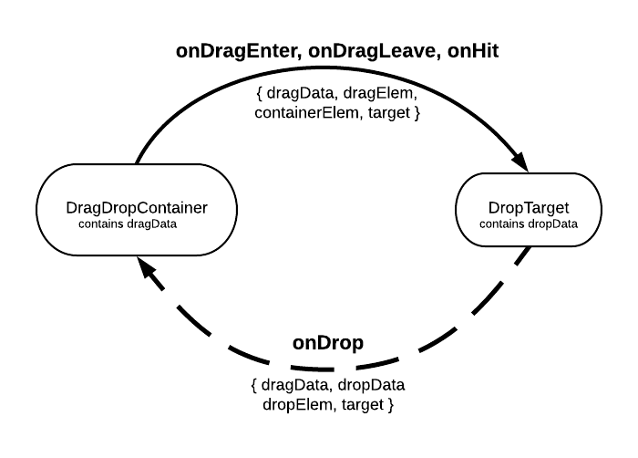

# DragDropContainer and DropTarget

Live demo: [peterh32.github.io/react-drag-drop-container](http://peterh32.github.io/react-drag-drop-container/)


## Features
* Very easy to implement and understand.

* Works on mouse and touch devices.

* Optional drag handles (with `dragHandleClassName` prop).

* Can constrain dragging to one dimension with `xOnly` and `yOnly` properties.

* Useful options like `dragClone` (drag a copy of the element), `customDragElement` (drag a custom element rather than the source object), and `disappearDraggedElement` (make the original element completely disappear while dragging). 

* Automatically scrolls the page when you drag to the edge, so you can drag to a target that's initially offscreen.

* Can implement using the components as wrappers or by passing them a render prop.

---
## Installation
Install it in your project using npm:

```
npm install react-drag-drop-container --save
```


---
## Basics

Set up a draggable element and a drop target for it:
```
import { DragDropContainer, DropTarget } from 'react-drag-drop-container';

<DragDropContainer targetKey="foo" >
    <div>Drag Me!</div>
</DragDropContainer>

<DropTarget targetKey="foo" >
    <p>I'm a valid drop target for the object above since we both have the same targetKey!</p>
</DropTarget>
```

---
## Anatomy of a Drag and Drop



* While dragging, the `onDragEnter` and `onDragLeave` events fire in the `DropTarget`. On a successful drop, the `onHit` event fires. These all pass the event data shown. 

* On a successful drop, the `onDrop` event fires in the `DragDropContainer`, passing back the event data shown.

---
## Wiring it Up

### In the DragDropContainer:
```
<DragDropContainer 
    targetKey="foo" 
    dragData={some object} 
    onDrop={some method}
    onDragStart={some method} 
    onDrag={some method} 
    onDragEnd={some method} 
>
    <div>Drag Me!</div>
</DragDropContainer>
```
`targetKey`: Determines what DropTargets it can be dropped on.

`dragData`:Custom data to pass to the drop target.

`onDrop`: Callback that fires after a successful drop on a compatible target. See [onDrop Event Data](#ondrop-event-data), below.

`onDragStart`, `onDrag`, `onDragEnd` (less commonly used): Callbacks during the drag process. See details in [DropTarget Callbacks](#droptarget-callbacks) below.

##### onDrop Event Data
Passed back to `DragDropContainer` in the `onDrop` event:
```
{
    dropData: [whatever you put in the dropData prop for the DropTarget]
    dropElem: [reference to the DOM element being dragged]
    dragData: [whatever you put in the dragData prop]
    target: [reference to the DragDropContainer DOM element]
    // for onDrag and onDragEnd events only:
    dropTarget: [the DOM element we're currently over]
    x: [current X position]
    y: [current Y position]
    ...plus a lot of standard event data
}
```

 ---

### In the DropTarget:
```
<DropTarget 
    targetKey="foo" dropData={some object} 
    onDragEnter={highlight method} 
    onDragLeave={unHighlight} 
    onHit={some function}
>
    <p>Drop something on me</p>
</DropTarget>
```

`dropData`: Custom data to pass back to the DragDropContainer.

`onDragEnter`, `onDragLeave`, `onHit`: Callbacks that fire when a compatible DragDropContainer 
passes over. `onHit` is when a compatible container is dropped on the target. See event data below.

##### Event Data for DropTarget
Passed in `onDragEnter`, `onDragLeave`, and `onHit`:

```
{
    dragData: [whatever you put in the dragData prop for the DragDropContainer]
    dragElem: [reference to the DOM element being dragged]
    containerElem: [reference to the DragDropContainer DOM element]
    target: [reference to the DropContainer DOM element]
    ...plus a lot of standard event data
}
```

---
## Usage

#### Set up Draggable Element

Wrap your element in a DragDropContainer:

```
import { DragDropContainer, DropTarget } from 'react-drag-drop-container';

<DragDropContainer>
    <span>Example</span>
</DragDropContainer>
```
The element should now be draggable.

##### Set up for dragging to a target
Add the data you want to send to the target when you drop the element on it:
```
<DragDropContainer dragData={{label: 'Example', id: 123}}>
	<span>Example</span>
</DragDropContainer>
```

Specify targetKey. This determines what dropTargets will accept your drag:
```
<DragDropContainer dragData={{label: 'Example', id: 123}} targetKey="foo">
	<span>Example</span>
</DragDropContainer>
```


#### Set up Target(s)

Wrap an element in a `DropTarget`, giving it the same `targetKey` as your draggable:
```
  <DropTarget targetKey="foo">
      [some element or text]
  </DropTarget>
```

(__Tip__: to create a target that can accept more than one `targetKey`, wrap your element in multiple `DropTarget`s, one for each `targetKey`.)

In DropTarget's parent, add handlers for the enter, leave, and drop events. For example:
```
  highlight(ev){
    this.setState({'highlighted': true})
  }

  unHighlight(ev){
 	this.setState({'highlighted': false})
  }
  
  dropped(ev){
    ... do something with event data ...
  }
```
Wire them up to DropTarget. In this example we are passing the "highlighted" state
to the child element, which we assume toggles some highlighted style.
```
  <DropTarget targetKey="foo" onDragEnter={this.highlight} onDragLeave={this.unHighlight} onHit={this.dropped}>
    <ChildElement highlighted=this.state.highlighted />
  </DropTarget>
```

## Tip: Using with a Render Prop
If you prefer, you can specify a render prop rather than a child component for `DragDropContainer` or `DropTarget`. 
i.e, These are equivalent:
```
    <DragDropContainer targetKey="foo">
        <div>Drag Me!</div>
    </DragDropContainer>
```
and
```
    <DragDropContainer 
        targetKey="foo">
        render={() => return <div>Drag Me!</div>}
    />
```


---
## DragDropContainer Props

### Key Props

These are not required, but you'll almost always want to set them.

##### dragData
Data about the dragged item that you want to pass to the target. Default is empty object.

##### targetKey
Optional string to specify which DropTargets will accept which DragDropContainers. Default is 'ddc'.

### Other Props

##### customDragElement
If a DOM node is provided, we'll drag it instead of the actual object (which
will remain in place). 

Example:
```
const elem = <div class="drag_elem">Drag Me</div>;

<DragDropContainer customDragElement={elem}>
```

##### disappearDraggedElement
If true, then dragging an element causes it to disappear such that it takes up no space. Defaults to
false, so that the original element space is still reserved while you are dragging. Not compatible with
`dragClone`. 

##### dragClone
If true, then the user appears to be dragging a copy of the original element (false by
default, so that the user appears to be dragging the element itself).

##### dragElemOpacity
Opacity of the element while it's dragging. (Sometimes you want to be able to see what's below the
element you're dragging.) Default is 0.9 (e.g. 90%).

##### dragHandleClassName
Class name for drag handle(s). Optional. If omitted, the whole thing is grabbable.

__Tip:__ If you are using drag handles on an element that contains an image,
use `<img draggable="false"...` to prevent the browser from letting users 
drag the image itself, which can be confusing.

##### noDragging
If true, dragging is turned off.

##### xOnly, yOnly
If true, then dragging is constrained to the x- or y direction, respectively.

##### zIndex
The z-index for the dragged item. Defaults to 1000 (so that it floats over the target). 
If that doesn't work for you, change it here.


#### DragDropContainer Callbacks 

All optional.
##### onDragStart(dragData)
Runs when you start dragging. `dragData` is whatever you passed in with
the dragData prop.

##### onDrag(dragData, currentTarget, x, y)
Runs as you drag.  `currentTarget` is the DOM element you're currently dragging
over; `x` and `y` are the current position.

##### onDragEnd(dragData, currentTarget, x, y)
When you drop.

##### onDrop(e)
Triggered after a drop onto a compatible DropTarget. This gets passed an event object, see [onDrop Event Data](#ondrop-event-data). 

---
## DropTarget Props

##### targetKey
Optional string to specify which DragDropContainers this target will accept.

##### dropData
Data to be provided to the DragDropContainer when it is dropped on the target.


#### DropTarget Callbacks 

All optional; specify in props.
##### onDragEnter(e), onDragLeave(e), onHit(e)
The event e contains
```
{
    dragData: [whatever you put in the dragData prop for DragDropContainer]
    dragElem: [reference to the DOM element being dragged]
    containerElem: [reference to the DragDropContainer DOM element]
    sourceElem: [reference to the DOM element containing children of DragDropContainer]
}
```

##### Example: make the target "consume" the draggable
Use `event.containerElem` to hide or delete the original element after a successful
drop.
```
  dropped(ev){
      ev.containerElem.style.visibility = 'hidden';
  }
```


---
## Development 

To view locally, clone the repository then
```
$ npm run install
$ npm run build
$ npm run watch
```

The demo will run on http://localhost:8080/

File locations:

```
/src    Source code for components
/demo   Source code for demo
/lib/bundle.js  Transpiled output
/public   Demo files, compiled
```


## License

MIT License

Copyright (c) 2017.

